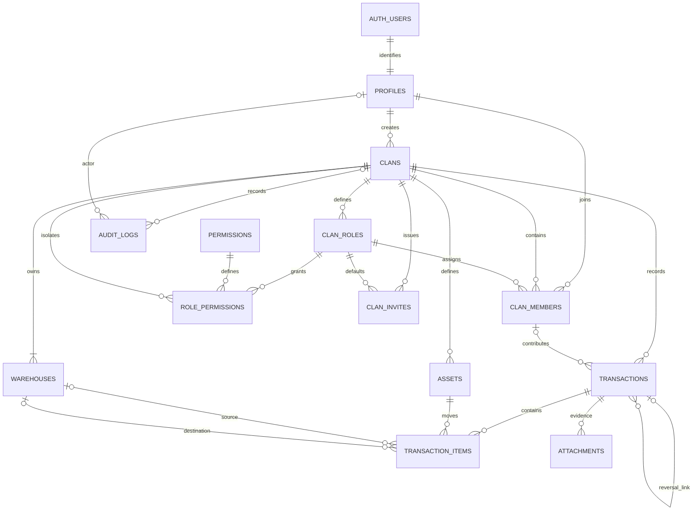

# KLANG Management — ส่งมอบ Phase 1–2

อ่าน Implementation Plan ครบทุกหัวข้อแล้ว งานรอบนี้จำกัดที่ Phase 1 และ Phase 2 ตามคำขอ **ยังไม่เริ่ม Phase 3** และไม่มี auth flow, session proxy, protected route, profile page หรือ Server Actions ของ feature เฟสถัดไป

## สิ่งที่ทำ

| Phase | ผลงาน                                                                                                                                                                                              |
| ----- | -------------------------------------------------------------------------------------------------------------------------------------------------------------------------------------------------- |
| 1     | Next.js 16.3.5 App Router, React 19, TypeScript strict, Tailwind 4, shadcn component configuration และ Button, responsive foundation, light/dark ตามระบบ, metadata ภาษาไทย, error/global-error/404 |
| 1     | Supabase browser/server SSR/admin factories, validated environment, server-only secret boundary                                                                                                    |
| 1     | ESLint, Prettier, Vitest, Playwright, npm scripts และ lockfile                                                                                                                                     |
| 2     | 13 public tables, 1 private role-template table, indexes, checks, tenant-safe composite foreign keys                                                                                               |
| 2     | Permission catalog 18 รายการ, default roles 5 แบบ, RLS ทุก public table, column-level grants                                                                                                       |
| 2     | create_clan, post_transaction, immutable posted transactions, append-only audit, computed ledger view                                                                                              |
| 2     | TypeScript types ที่ generate จาก PostgreSQL schema จริง และ integration tests รวม concurrency                                                                                                     |

## Database ERD

Transaction items และ attachments มี `clan_id` ของตนเองและ composite FK ร่วมกับ parent ID แม้ diagram จะลดเส้นซ้ำเพื่อให้อ่านง่าย ส่วน created_by/approved_by/voided_by/uploaded_by อ้าง profiles ตาม migration

## Schema และ invariants

- UUID primary keys; timestamps ใช้ timestamptz; transaction_date default คำนวณจาก UTC; quantity/unit_value ใช้ numeric(20,4)
- profiles ไม่มี password หรือ email; password/email เป็นความรับผิดชอบของ Supabase Auth
- username และ slug เป็น citext unique; username ปัจจุบันใช้ ASCII ตัวอักษร/ตัวเลข/underscore 3–32 ตัว, slug lowercase/hyphen ไม่เกิน 80 ตัว
- ข้อมูล tenant มี clan_id รวมถึง role_permissions ที่เพิ่มจากรายการ field ในแผนให้สอดคล้องกับกฎ tenant isolation; profiles และ permissions เป็นข้อมูลระดับบัญชี/global; clans เป็น tenant root
- composite FK ป้องกัน role/member/invite/asset/warehouse/transaction/attachment/reversal อ้างข้าม clan
- role ที่มีสมาชิกหรือ invite อ้างอยู่ลบไม่ได้; system roles และ system permission mappings แก้จาก application ไม่ได้; custom roles ใช้ member.manage
- default warehouse ต้องมี **หนึ่งแห่งและ active** ตอน commit: partial unique index ป้องกันมากกว่าหนึ่ง และ deferred constraint ป้องกันไม่มี default
- ทุก clan ต้องเหลือ ACTIVE Manager อย่างน้อยหนึ่งคน; migration Phase 4 เปลี่ยนผู้สร้างและ invariant จาก Leader เป็น Manager
- transaction_no และ client_request_id unique ต่อ clan; duplicate client_request_id ถูกปฏิเสธด้วย unique constraint; post ซ้ำไม่เพิ่ม ledger
- item quantity > 0 และไม่เป็น NaN; decimal_places 0–4; ตรวจ precision ตาม asset ตอน post
- asset/warehouse ที่ inactive ใช้ post ไม่ได้; deposit เข้า default ปัจจุบันเท่านั้น; transfer ต้องมีต้นทาง/ปลายทางต่างกัน; adjustment ใช้หนึ่งทิศทางต่อบรรทัด
- ยอด derived จาก POSTED เท่านั้น ไม่มี balance table ให้แก้ตรง ๆ; view เป็น security_invoker
- post ล็อก clan เพื่อ serialize การทำรายการ แล้วล็อก header/assets/warehouses; item mutation ล็อก parent header ป้องกันการเปลี่ยน item ระหว่าง post
- ตรวจ balance หลังรวมทุกบรรทัดตาม asset/warehouse; ยอดติดลบได้เฉพาะ asset ที่ allow_negative=true
- POSTED/VOIDED/REJECTED header และ item ของรายการที่พ้น DRAFT เปลี่ยนตรง ๆ ไม่ได้
- audit trigger บันทึก before/after และ actor ของทุก mutation ในตารางธุรกิจ; ปิด update/delete และตัด invite_code ออกจากข้อมูล audit
- attachments metadata จำกัดขนาดไม่เกิน 10 MiB และ path ต้องเริ่ม clan_id/transaction_id; ยังไม่เปิด upload หรือ Storage buckets/policies

## Migrations

| ไฟล์                                | เนื้อหา                                                                                              |
| ----------------------------------- | ---------------------------------------------------------------------------------------------------- |
| 20260921000100_schema.sql           | extensions, 13 tables, status/type checks, PK/unique/composite FK, indexes                           |
| 20260921000200_security.sql         | permissions/default-role templates, helpers, RLS, explicit table/column/function grants              |
| 20260921000300_ledger_functions.sql | audit/integrity triggers, deferred default/Leader checks, atomic RPCs, security-invoker balance view |

apply ทั้งสามไฟล์สำเร็จบนฐานข้อมูล PostgreSQL 17 ใหม่ใน test run; seed ไม่มี mock application data และไม่จำเป็นต่อ permissions ใน production

## RLS policy summary

| Object                   | Read                                         | Write                                                                                                               |
| ------------------------ | -------------------------------------------- | ------------------------------------------------------------------------------------------------------------------- |
| profiles                 | เจ้าของบัญชีเท่านั้น                         | ปิด application writes รอ Phase 3                                                                                   |
| permissions              | authenticated                                | migration/admin เท่านั้น                                                                                            |
| clans                    | ACTIVE member + ACTIVE profile + ACTIVE clan | clan.manage เฉพาะชื่อ/game/server/logo; create ผ่าน RPC                                                             |
| clan_roles               | ACTIVE member                                | member.manage เฉพาะ custom role; ห้ามลบ role ที่ถูกอ้างอิง                                                          |
| role_permissions         | ACTIVE member                                | member.manage เฉพาะ custom role ของ clan เดียวกัน                                                                   |
| clan_members             | member.view หรือ membership ของตนเอง         | member.manage เปลี่ยน role/character/status; ห้ามเอา Manager คนสุดท้ายออก                                           |
| clan_invites             | member.manage                                | ปิดจนมี atomic invite/join flow                                                                                     |
| warehouses               | warehouse.view                               | warehouse.create สำหรับสร้าง; warehouse.edit สำหรับชื่อ/description/order; ไม่เปิด direct default/deactivate/delete |
| assets                   | asset.view                                   | asset.manage สำหรับสร้างและแก้ชื่อ/รูป; ปิดการแก้คุณสมบัติ ledger ตรง ๆ                                             |
| transactions             | transaction.view                             | DRAFT เท่านั้น และ permission ตรงประเภท; status/approval/void/identity ถูกปิดด้วย column grants/trigger             |
| transaction_items        | transaction.view                             | parent DRAFT + permission ของ transaction และ tenant-safe FK                                                        |
| attachments              | transaction.view                             | ปิดจนมี evidence workflow                                                                                           |
| audit_logs               | audit.view                                   | insert จาก trigger; ไม่มี application insert/update/delete                                                          |
| warehouse_asset_balances | ผ่าน RLS ของ transactions/items              | read-only derived view                                                                                              |

Anonymous ไม่มี table access หรือสิทธิ์ execute helper/RPC; ไม่มี anonymous username/email lookup. Helpers ตรวจ ACTIVE profile/membership/clan และใช้ fixed empty search_path. private schema ไม่ถูก expose ผ่าน Data API.

Default Member อ่านข้อมูลพื้นฐานและรายงานได้ แต่ไม่มี mutation permissions; Depositor เพิ่ม deposit; Treasurer เพิ่ม deposit/withdraw/transfer; Approver เพิ่ม approve; Leader และ Manager มีทั้ง 18 permissions. ผู้สร้าง Clan/Gang ใหม่เป็น Manager และบัญชีเดียวมี role ต่างกันในแต่ละ clan ได้

DRAFT post ต้องมี permission ตรงประเภท; PENDING post ต้องมี transaction.approve และบันทึก approved_by/approved_at. Approver เดิม retry POSTED ของตนได้เมื่อยังมีสิทธิ์. ยังไม่มี API เปลี่ยน DRAFT เป็น PENDING หรือ approval UI

## ผลตรวจสอบ

| คำสั่ง                    | ผล                                              |
| ------------------------- | ----------------------------------------------- |
| npm run lint              | ผ่าน                                            |
| npm run typecheck         | ผ่าน                                            |
| npm test                  | ผ่าน 33 tests: 2 unit + 31 database             |
| npm run test:e2e          | ผ่าน 4 tests: desktop/mobile homepage และ 404   |
| npm run build             | ผ่าน production build; routes / และ /_not-found |
| npm run db:types:embedded | generate จาก migrated PostgreSQL 17 สำเร็จ      |
| npm run format:check      | ผ่าน                                            |

Database tests ใช้ PostgreSQL จริง ไม่ได้ mock SQL/RLS/transaction engine. ครอบคลุม cross-tenant reads/writes, custom/default roles, anonymous access, blocked/removed/suspended access, composite FK, atomic clan rollback, default/Manager constraints, immutable audit/ledger, precision/active asset/default warehouse, transfer conservation, insufficient balance, duplicate requests, concurrent withdrawals, concurrent retries และ pending approval

Fixture harness สร้าง minimal auth.users/auth.uid()/database roles เพื่อจำลองสัญญาการเชื่อมต่อ Supabase Auth เฉพาะการทดสอบ SQL. **ยังไม่ได้ตรวจบริการ Supabase Auth, PostgREST หรือ Storage แบบครบ stack** และยังไม่ได้ apply migration บน cloud project

## ปัญหาที่พบและการแก้ไข

1. Windows sandbox เริ่ม process ไม่ได้ (CreateProcessWithLogonW 1385): ใช้คำสั่งที่ได้รับอนุมัติผ่าน execution channel ที่ทำงานได้
2. npm install เริ่มซ้อนกับ scaffold ทำให้ไฟล์ dependency ชนกัน: ล้างเฉพาะ node_modules ของโปรเจกต์ใหม่แล้วติดตั้งใหม่ตามลำดับ; ปรับ @types/node เป็น 24 ให้ตรงกับ runtime และ Vitest
3. Docker Desktop backend ไม่พร้อม (API 500/pipe unavailable): ทดสอบ SQL ด้วย native PostgreSQL 17 ในฐานข้อมูลชั่วคราวที่แยกจากข้อมูลจริง
4. Supabase CLI gen types ยังต้องใช้ Docker image แม้ส่ง db-url: เตรียม CLI script ไว้ และใช้ official Supabase postgrest-typegen engine generate types จากฐานข้อมูลจริงแทนในรอบนี้
5. Shared deferred trigger อ้าง field ที่ clans ไม่มี: เปลี่ยนการอ่าน tenant จาก row JSON และทดสอบใหม่ผ่าน
6. POSTED retry ของ Approver เดิมถูกปฏิเสธเพราะไม่มี deposit permission: เพิ่มเงื่อนไข retry ของผู้อนุมัติเดิมที่ยังมี approve permission พร้อม regression test
7. postgres-meta server dependency มี audit findings: เปลี่ยนเป็น official typegen library ที่เล็กกว่า; หลังเปลี่ยน npm audit ไม่พบ vulnerabilities

## สิ่งที่ต้องตัดสินใจก่อนทำต่อ

ก่อน Phase 3:

1. ใช้ Supabase cloud project ใด/organization และ region ใดสำหรับ klang-management; ยังไม่มี project URL/keys และยังไม่สร้าง cloud project หรือ GitHub remote
2. ยืนยันกติกา username: ใช้ 3–32 ตัว ASCII/ตัวเลข/underscore ตาม schema ปัจจุบันหรือขยายรองรับอักษรไทย และอนุญาตเปลี่ยน username หลังสมัครหรือไม่
3. เปิด email confirmation ก่อนเข้าใช้หรือไม่; กำหนด domain/redirect URLs และ SMTP provider สำหรับยืนยันอีเมล/รีเซ็ตรหัสผ่าน
4. เลือก persistent/shared rate-limit backend และค่าจำกัด username login; ห้ามใช้ in-memory counter เป็นมาตรการ production บนหลาย instance

ก่อนเฟสธุรกรรมในภายหลัง:

- กำหนดธุรกรรมใดต้อง approve, threshold และอนุญาตผู้สร้างอนุมัติเองหรือไม่; schema รองรับสถานะ แต่ยังไม่มี submission/approval workflow
- นิยาม Void/Reversal: แผนให้คำนวณเฉพาะ POSTED ขณะเดียวกันมี VOIDED และ reversal; ต้องยืนยันวิธีเก็บต้นฉบับเพื่อไม่หักยอดซ้ำ ก่อนเปิด reversal API. รอบนี้ reject REVERSAL post และปิด lifecycle writes ไว้
- อนุมัติเงื่อนไขปิด warehouse/asset ที่มี balance หรือ draft ค้าง และข้อกำหนดหลักฐาน (ขนาด/MIME/retention) ก่อนเปิด management/upload actions
- จำนวน numeric(20,4) อาจเกินความแม่นยำของ JavaScript Number; ต้องกำหนดขอบเขตจำนวนที่ UI รับ หรือวิธีส่ง decimal ที่ไม่สูญเสียความแม่นยำ ก่อนทำฟอร์มธุรกรรม

ไม่จำเป็นต้องตัดสินใจประเด็นของเฟสหลังเพื่อเปิดตรวจงาน Phase 1–2 นี้ แต่ยังไม่ควรเปิด flow เหล่านั้นก่อนข้อกำหนดชัดเจน

## ไฟล์สำคัญ

- src/app: foundation, layout, error/global-error/not-found และ theme
- src/components/ui/button.tsx, components.json: shadcn component foundation
- src/lib/env.ts, src/lib/supabase: typed SSR factories และ secret separation
- supabase/config.toml, migrations, seed.sql: database project/schema/security
- src/types/database.ts: generated types
- tests/database: disposable PostgreSQL harness และ security/ledger tests
- tests/unit, tests/e2e: config validation และ responsive smoke tests
- scripts: Supabase CLI/embedded type generation
- package.json/package-lock.json, eslint/prettier/vitest/playwright configs: reproducible tooling

Reference documentation: [Next.js installation](https://nextjs.org/docs/app/getting-started/installation), [Supabase SSR clients](https://supabase.com/docs/guides/auth/server-side/creating-a-client), [Supabase type generation](https://supabase.com/docs/guides/api/rest/generating-types).
